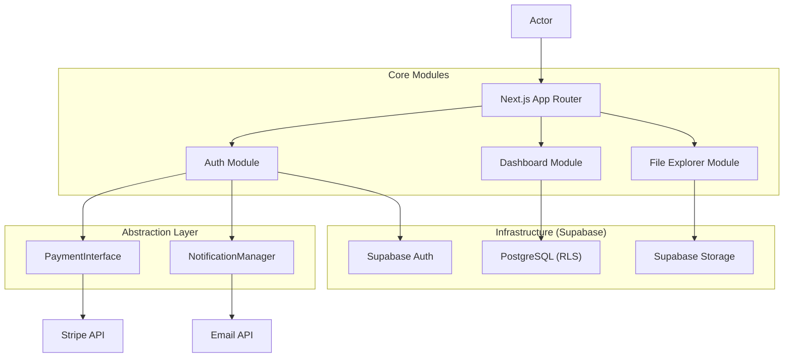

# TECH SPEC: Core SaaS Framework (Single-Org)

> **Ref**: `.agent/scratchpad/PRD_current.md`

## 1. Architecture

**Pattern**: Domain-Driven Modular Monolith (Next.js)
**Core Principle**: "Single-Org, Strict RBAC, Abstracted Pipes"



## 2. Data Model (Supabase)

**Key Decision**: No `tenant_id`. Data is partitioned logically by `organization_id` ONLY if we ever revert, but for now, we assume ONE install = ONE db.
**RBAC Enforcement**: `profiles` table is the source of truth.

```sql
-- ENUMs
CREATE TYPE user_role AS ENUM ('admin', 'manager', 'teacher', 'student');

-- PROFILES
CREATE TABLE profiles (
  id UUID REFERENCES auth.users ON DELETE CASCADE,
  role user_role DEFAULT 'student',
  full_name TEXT,
  avatar_url TEXT,
  metadata JSONB, -- For custom fields per org
  PRIMARY KEY (id)
);

-- RLS POLICY (Example)
-- "Users can read their own profile"
CREATE POLICY "Public profiles are viewable by everyone"
ON profiles FOR SELECT USING ( true );

-- "Only Admins can update roles"
CREATE POLICY "Admins can update roles"
ON profiles FOR UPDATE USING (
  auth.uid() IN (SELECT id FROM profiles WHERE role = 'admin')
);
```

## 3. Abstraction Maps

We will use TypeScript Interfaces to enforcing decoupling.

**Base Types**:

```typescript
type Subscription = { id: string; status: "active" | "canceled" | "past_due" };
type Message = { role: "user" | "assistant"; content: string };
type Response = { text: string; raw: any };
type Task = { id: string; title: string; deadline: Date };
type Insight = { trend: string; score: number };
type DraftId = string;
type Status = "success" | "failed" | "pending";
```

**Payment Interface**:

```typescript
interface PaymentProvider {
  createSubscription(userId: string, planId: string): Promise<Subscription>;
  cancelSubscription(subId: string): Promise<void>;
  getBillingPortalUrl(userId: string): Promise<string>;
}
// Implementations: StripeProvider, MockProvider
```

**Notification Interface**:

```typescript
interface NotificationProvider {
  sendEmail(to: string, subject: string, body: string): Promise<void>;
  sendPush(userId: string, title: string, body: string): Promise<void>;
  sendBroadcast(groupId: string, message: string): Promise<void>;
}
```

**Reporting Interface**:

```typescript
interface ReportProvider {
  generateExcel(data: any[], fileName: string): Promise<Buffer>;
  generatePDF(templateId: string, data: any[]): Promise<Buffer>;
  generateFullExportManifest(userId: string): Promise<JSON>;
}
```

**AI Orchestrator**:

```typescript
interface AIProvider {
  chat(messages: Message[], locale: string): Promise<Response>; // Support multilingual coaching
  generateTasks(context: string): Promise<Task[]>;
  researchTrends(niche: string, locales: string[]): Promise<Insight[]>; // Native cross-border research
}
```

**External Connector**:

```typescript
interface ConnectorProvider {
  getAuthUrl(platform: "instagram" | "facebook"): Promise<string>;
  preparePublish(
    platform: string,
    mediaUrl: string,
    caption: string
  ): Promise<DraftId>; // Human-in-the-loop start
  confirmPublish(draftId: string): Promise<Status>; // Ready for future autonomous migration
}
```

## 4. State, Offline & Scheduling Strategy

**Global State**: `Zustand` with `persist` middleware.

- **Store**: `useSessionStore` for transient workflow data.
- **Engine**: `IndexedDB` (via `idb-keyval`).

**Native Parity (PWA)**:

- **Hooks**: `useHaptics` (vibration), `usePushRegistry` (service worker sync).
- **Styling**: Mandatory use of CSS `logical properties` for RTL parity.

**Scheduling Engine**:

- **Strategy**: Leverages **Inngest** or **Supabase Edge Functions + pg_cron**.
- **Usage**: Handles delayed tasks (e.g., "Apply this social post at 10 AM on Tuesday").

## 4. API Contract (Core Profile)

**Endpoint**: `GET /api/profile`
**Request**: (Authenticated Cookie)
**Response**:

```json
{
  "id": "uuid",
  "role": "admin",
  "full_name": "Lior Shtram",
  "avatar_url": "...",
  "metadata": {}
}
```

## 5. Deployment & Fleet Strategy

**Core Principle**: Standardized Environment Configuration.

- **Fleet Manifest**: Each instance maintains a `.fleet/config.json` defining its specific feature flags and provider mappings (e.g., `PAYMENT_PROVIDER: "stripe"`).

## 6. Implementation Plan

- [ ] **Phase 1: Foundation**
  - [ ] Initialize Next.js 15 (App Router, TypeScript, No Tailwind).
  - [ ] Create initial migration `0001_initial_schema.sql` (Profiles + RBAC).
  - [ ] Configure Supabase Client (SSR compliant).
  - [ ] Setup Zustand store with IndexedDB persistence.
- [ ] **Phase 2: Auth & RBAC**
  - [ ] Implement Login/Signup with profile auto-creation trigger.
  - [ ] Add Middleware-based route protection.
  - [ ] Comprehensive RLS testing Suite.
- [ ] **Phase 3: Abstraction Layers**
  - [ ] Implement `PaymentProvider`, `NotificationProvider`, and `AIProvider` interfaces.
  - [ ] Create Mock and Initial Real implementations (Stripe/Resend).

## 5. Security & Risks

- **Risk**: Improper RLS configuration leaks data.
  - **Mitigation**: `tests/auth/rls.test.ts` must simulate all roles against protected tables.
- **Risk**: Client-side role spoofing.
  - **Mitigation**: ALL sensitive logic checks `auth.uid()` -> `profiles.role` on the SERVER/DB, never trusting the client cookie alone.
