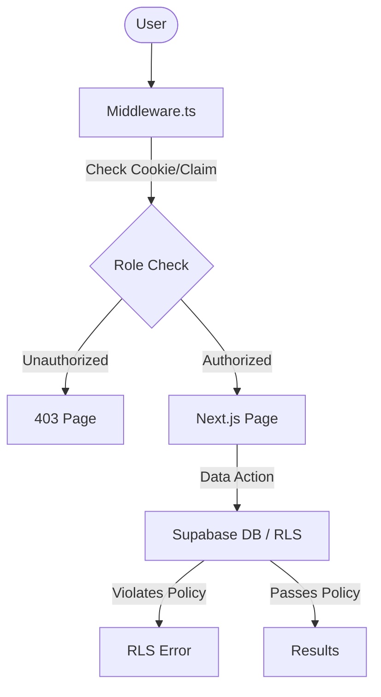

# TECH SPEC: Role-Based Access Control (RBAC)

> **Ref**: [docs/PRD_RBAC.md](PRD_RBAC.md)

## 1. Traceability Matrix

| Requirement ID     | Implementation File                         | Function/Component              |
| :----------------- | :------------------------------------------ | :------------------------------ |
| **REQ-RBAC-001**   | `supabase/migrations/YYYYMMDD_add_rbac.sql` | `TYPE app_role AS ENUM`         |
| **REQ-RBAC-002**   | `supabase/migrations/YYYYMMDD_add_rbac.sql` | `POLICY "Public Profiles"`      |
| **REQ-RBAC-003**   | `supabase/migrations/YYYYMMDD_add_rbac.sql` | `POLICY "Self Update"`          |
| **REQ-RBAC-004**   | `supabase/migrations/YYYYMMDD_add_rbac.sql` | `POLICY "Admin Only Roles"`     |
| **REQ-RBAC-009**   | `src/middleware.ts`                         | `updateSession()` (Route Guard) |
| **REQ-RBAC-UI-01** | `src/app/dashboard/admin/page.tsx`          | `UserTable`                     |
| **REQ-RBAC-UI-02** | `src/components/rbac/RoleBadge.tsx`         | `RoleBadge`                     |
| **REQ-RBAC-UI-03** | `src/components/rbac/RoleSelect.tsx`        | `RoleSelect`                    |
| **REQ-RBAC-UI-04** | `src/components/rbac/RoleSelect.tsx`        | `isDisabled={isSelf}`           |
| **REQ-RBAC-UI-05** | `src/components/admin/UserModal.tsx`        | `CreateUserForm`                |
| **REQ-RBAC-UI-06** | `src/app/403/page.tsx`                      | `AccessDeniedPage`              |

## 2. Architecture

**Pattern**: Hybrid RLS + Edge Middleware
**Diagram**:



## 3. Data Model

**Schema Changes** (`supabase/migrations/...`):

```sql
-- 1. Create Enum
CREATE TYPE app_role AS ENUM ('system_admin', 'org_admin', 'manager', 'teacher', 'student');

-- 2. Update Profiles
ALTER TABLE public.profiles ADD COLUMN role app_role NOT NULL DEFAULT 'student';

-- 3. RLS Helper
CREATE FUNCTION auth.user_role() RETURNS app_role AS $$
  SELECT role FROM public.profiles WHERE id = auth.uid()
$$ LANGUAGE sql STABLE;

-- 4. Policies (Example)
CREATE POLICY "Admins can update roles" ON public.profiles
  FOR UPDATE USING (auth.user_role() IN ('system_admin', 'org_admin'));
```

## 4. API Contract

**Admin Actions** utilize Server Actions for mutations (optimistic updates in UI).

**Endpoint/Action**: `updateUserRole(userId, newRole)`

- **Input**: `userId: string`, `newRole: AppRole`
- **Logic**:
  1. Check `auth.user_role()` matches Admin.
  2. Check `userId != auth.uid()` (Self-Demotion Guard).
  3. Update DB.
  4. Revalidates path.

## 5. Implementation Plan

- [ ] **Migration**: Create SQL for Enum and RLS policies.
- [ ] **Types**: Generate TypeScript types (`database.types.ts`).
- [ ] **Middleware**: Implement route protection logic.
- [ ] **Components**: Build `RoleBadge`, `RoleSelect`.
- [ ] **Pages**: Build `/dashboard/admin` and `/403`.
- [ ] **Storybook**: Add stories for new components.
- [ ] **Verify**: Run Test Suite.

## 6. Security & Risks

- **Risk**: Middleware drift (middleware checks outdated roles if session cached).
- **Mitigation**: Critical actions (DB writes) usually fail at RLS level even if Middleware passes. "Defense in Depth".
- **Risk**: Self-Demotion locked out.
- **Mitigation**: UI Check + DB Constraint/Trigger (optional) prevents last admin demotion.
